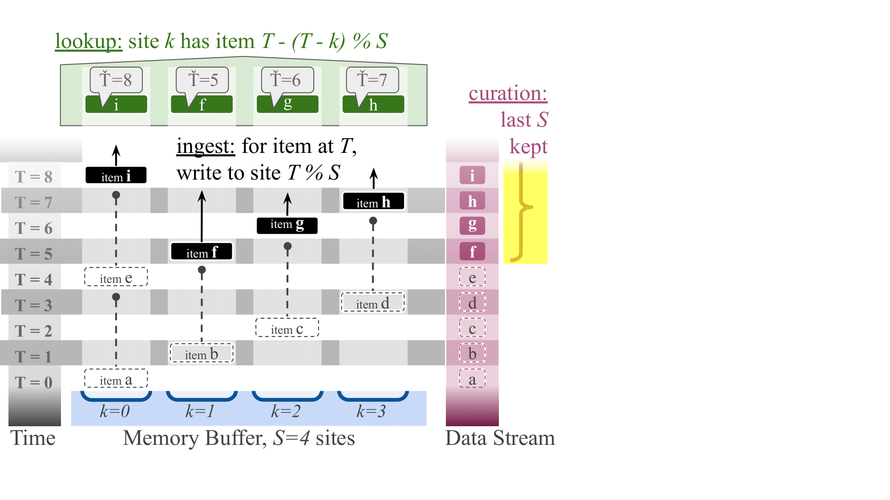
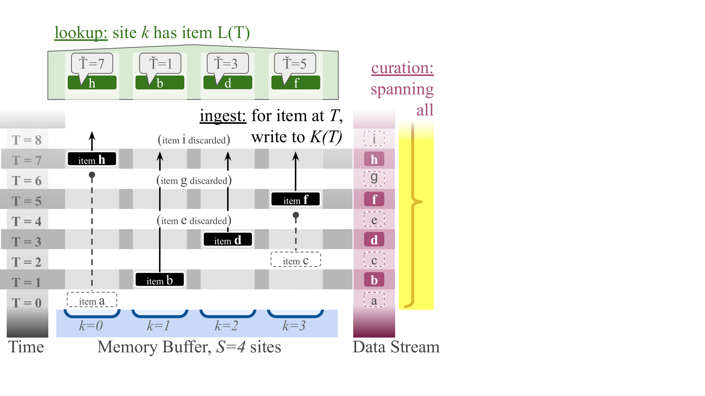

# Quickstart

[Selecting a downstream Algorithm](algorithm.md).

## Ring Buffer Generalization Intuition


Data streams consist of a strictly-ordered sequence of read-once inputs that often exceed available memory capacity. Traditional approaches like circular ring buffers address this limitation by maintaining only the most recent data points and discarding older information.



In contrast, *downstream* maintains representative, approximate records of stream history by introducing three novel algorithms: 1) "steady" creates evenly spaced snapshots across the entire history, 2) "stretched" preserves important older data points, and 3) "tilted" prioritizes recent information.


## Installing

To install from PyPi with pip, run

```bash
python3 -m pip install downstream
```

Or optionally, to install with JIT

```bash
python3 -m pip install "downstream[jit]"
```

A containerized release of `downstream` is available via <https://ghcr.io>

```bash
singularity exec docker://ghcr.io/mmore500/downstream python3 -m downstream --help
```

*downstream* is also available in [C++](cpp.md), [Rust](rust.md), [Zig](zig.md), and [CSL](csl.md). Installation instructions are avaiable on each of their respective pages.

## Working with the Data Structure

- Buffer size must be a power of 2 (e.g., 8, 16, 32)
- Site assignment maps data item index T to a storage location using either:

    - `assign_storage_site`: For processing single data points
    - `assign_storage_site_batched`: For efficient processing of multiple data points

- For hstrat users: You can store a random differentia or make a random choice whether to toggle one-bit differentia with each data point

### Example: Using the Steady Algorithm
```python
from downstream import dstream

# Initialize a buffer with size 8 (must be a power of 2)
buffer_size = 8

# Process a stream of data items
for data_index in range(20):
    # Determine site based on buffer size and index T
    site = dstream.steady_algo.assign_storage_site(buffer_size, data_index)

    if site is not None:
        # Store data at the selected site
        print(f"Data point {data_index} stored at position {site}")
```

## Lookup


## Serializing


## Running Lookup via Dataframe CLI