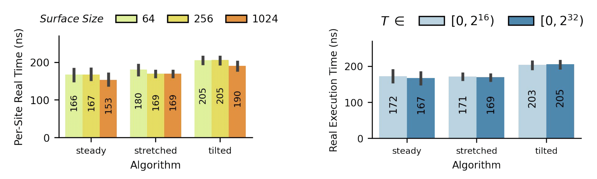

# Summary

Downstream offers efficient algorithms for curation of continuous data streams across multiple programming languages including C++, Python, Rust, Zig, and the Cerebras Software Language. These data streams often exceed available memory capacity and consist of a strictly-ordered sequence of read-once inputs. While traditional approaches like circular ring buffers address this limitation by retaining only the most recent data points, Downstream maintains representative, approximate records of stream history through three novel algorithms: (1) "steady," which creates evenly spaced snapshots across the entire history; (2) "stretched," which preserves important older data points; and (3) "tilted," which prioritizes recent information. The library features extensive cross-implementation testing, automated documentation and deployment, and is available through standard package managers.

# Statement of Need

Efficient data stream processing is a foundational challenge in modern computing systems, where the ability to analyze continuous, high-velocity data has become critical across domains. Digital evolution systems, sensor networks, financial markets, and environmental monitoring applications all generate data at rates that exceed practical storage capacity while requiring longitudinal analysis across varying time horizons.

Downstream addresses the limitations of traditional approaches by providing algorithms that intelligently compress stream history while preserving significant information across configurable temporal distributions. By operating exclusively with primitive operations and eliminating metadata overhead, the framework enables efficient operation in severely resource-constrained environments like IoT devices, where available memory may be measured in kilobytes rather than gigabytes. This capability is particularly valuable for applications such as hereditary stratigraphy in phylogenetic tracking [@moreno2022hstrat], where memory-efficient lineage record keeping must be maintained across distributed computing environments.

# Methods

In order to simplify the process of stream curation, this approach makes some assumptions. First, the output buffer is of a fixed length; second, upon storing, data is not subsequently edited or moved. Thus, the only operations that can be made on ingested data items is discarding them without storage, storing it, and overwriting previously stored data. This reduces the problem of stream curation to one of site selection, or determining where to place each subsequent data item.

# Implementation

Downstream has been implemented across five programming languages in order to maximize compatibility with diverse computing environments. Each of the implementations are located in a separate branch of the Downstream GitHub repository and contain implementations for site selection using any of the three Downstream algorithms. In addition, some branches implement additional algorithms including hybrid variants, etc. In order the enhance usability and reliability, the framework incorporates several features:
1. Each algorithm is run against cross-validation tests with other language versions to ensure consistent behavior.
2. Documentation is available for all languages, with function headings listed for at least for one of the algorithms. All other algorithms should share the same heading.
3. The library is available through standard package managers for each supported language, including pip for Python and Cargo for Rust. It is also available for C++ as a header-only library.
4. Users can specify precise memory constraints, allowing the framework to adapt to varying resource environments without compromising functionality.

# Results and Performance

Preliminary testing has shown that for all Downstream algorithms, there appears to be no variation in execution time for site selection operations regardless of the buffer size or the number of data poitns. That is, due to Downstream’s zero overhead approach, it can maintain efficient stream curation regardless of the environment. Though statistical analysis has yet to be done to confirm this result, the output of the tests thus far can be seen in \autoref{fig:benchmark}.

# Projects Using the Software

The work by [@moreno2022hstrat] incorporates Downstream algorithms for maintaining historical records in distributed digital evolution simulations, tracking phylogenetic information across massively distributed, agent-based experiments conducted on the 850,000 core Cerebras Wafer-Scale Engine (Moreno et al. (2024)).

# Related Software

Several existing frameworks address aspects of data stream processing with approaches distinct from Downstream. Algorithm 938 [@10.1145/2559995] employs a circular buffer-related methodology for data sequence compression but implements different mechanisms for data point selection and historical representation.

# Future Work

To validate these algorithms, we plan to conduct further  benchmarks comparing memory efficiency, throughput, and information retention quality across all five language implementations (Python, C++, Rust, Zig, and CSL). These benchmarks will measure performance under various resource constraints, simulating real-world scenarios in embedded systems and high-throughput applications.

To further improve accessibility, we plan to continue implementing Downstream in more languages, e.g. Julia. Each new implementation will follow the existing structure mentioned previously.

For stretched and tilted algorithms, which currently support ingestions up to 2^S-2, future work will address behavior past this point, potentially by switching to steady curation on logical time hanoi value H(T) rather than on logical time T itself.

# Acknowledgements

This material is based upon work supported by the U.S. Department of Energy, Office of Science, Office of Advanced Scientific Computing Research (ASCR), under Award Number DE-SC0025634. This report was prepared as an account of work sponsored by an agency of the United States Government. Neither the United States Government nor any agency thereof, nor any of their employees, makes any warranty, express or implied, or assumes any legal liability or responsibility for the accuracy, completeness, or usefulness of any information, apparatus, product, or process disclosed, or represents that its use would not infringe privately owned rights. Reference herein to any specific commercial product, process, or service by trade name, trademark, manufacturer, or otherwise does not necessarily constitute or imply its endorsement, recommendation, or favoring by the United States Government or any agency thereof. The views and opinions of authors expressed herein do not necessarily state or reflect those of the United States Government or any agency thereof. This material is also based upon work supported by the Eric and Wendy Schmidt AI in Science Postdoctoral Fellowship, a Schmidt Sciences program. Computational resources were provided in part by the Michigan State University Institute for Cyber-Enabled Research (ICER).

# References

\pagebreak
\appendix